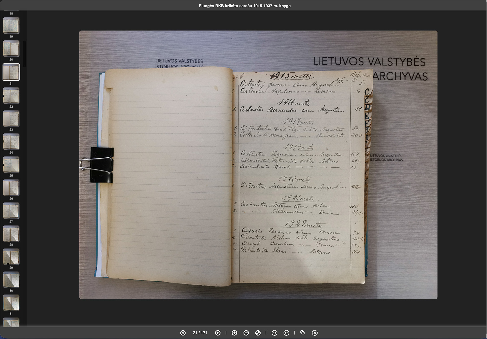

Genmetrika.eu gallery Tampermonkey userscript
----------------------------------------------

Enhances the browsing experience on genmetrika.eu photo galleries by providing a convenient interface. It opens a modal window displaying all thumbnails in a sidebar, a large image in the center, and offers features like zooming, rotating, copying the link, and fast navigation using keyboard or mouse.

## Key Features
- Modal Window: Displays all page thumbnails in a sidebar, providing easy access to multiple images.
- Large Image: Centrally placed for easy viewing and interaction.
- Zoom: Allows zooming in and out using buttons, the mouse wheel, or the + and - keys.
- Rotate: Rotates the image 90° in both directions with buttons or keyboard shortcuts.
- Fast Navigation: Arrow keys or clicking thumbnails enable quick navigation through the gallery.
- Active Thumbnail: Maintains the active thumbnail centered in the sidebar for easy access.
- One-Click Link Copy: Provides a convenient way to copy the link to the current image.
- Compatibility: Works seamlessly with all genmetrika.eu index and large image pages.

## Screenshot

*Example: The gallery modal with sidebar thumbnails and image controls.*

## Installation
1. Install Tampermonkey: Ensure you have the Tampermonkey extension installed in your browser.
2. Install/Update Script:
    - Click the provided link to install or update the script directly: [Install/Update genmetrika-gallery.user.js](https://raw.githubusercontent.com/acirtautas/genmetrika-gallery/main/genmetrika-gallery.user.js).
    - Alternatively, download and copy [`genmetrika-gallery.user.js`](https://github.com/acirtautas/genmetrika-gallery/blob/main/genmetrika-gallery.user.js) from this repository and manually add it to your Tampermonkey extension.
3. Refresh a genmetrika.eu Page: Upon refreshing, you’ll notice a blue triangle in the top right corner. Clicking this triangle opens the gallery.

## Usage
- Navigation: Use arrow keys, click thumbnails, or utilize the control buttons to navigate through the gallery.
- Zoom: Zoom in and out using the +, - keys or the mouse wheel.
- Rotate: Rotate the image by clicking the rotation buttons or using keyboard shortcuts.
- Close the Modal: To close the modal window, click “Close” or press “Esc”.

Good luck in your research and enjoy the enhanced gallery experience!
